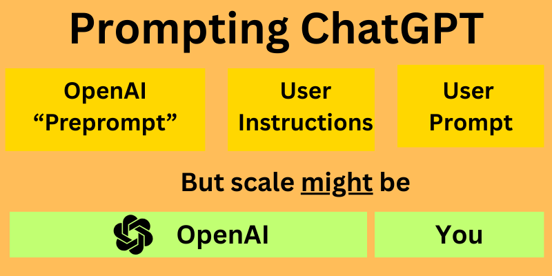

# ChatGPT Custom Instructions


Guide to understanding and effectively using ChatGPT's Custom Instructions feature.

## Overview

Custom Instructions provide users with the ability to guide ChatGPT's behavior across conversations. They act as system prompts that are applied to every interaction, helping to tailor the AI's responses to your specific needs and preferences.

## What Are Custom Instructions?

Custom Instructions are system prompts that:
- Apply across all conversations with ChatGPT
- Help transform a generalist model into a more specialized assistant
- Are inserted between the large language model and every turn in the conversation
- Allow users to influence ChatGPT's tone, formatting, and response style

## The Mechanics of System Prompting



System prompts are the familiar prompts that come before what the user writes. They're prompts that apply across conversations and take a generalist model and hone it in on a specific purpose. 

An AI "assistant" (or what OpenAI popularized as custom GPT) consists, basically, of a system prompt guiding an LLM. Assistants can be enhanced with tools and called agents. But even in non-conversational workflows like automations, the system prompt remains highly relevant.

In conversational interfaces like ChatGPT, they're especially important because they're wedged between the large language model and every single back-and-forth (turn) in the conversation.

Although in reality caching and other mechanisms make their operation more discerning, LLM APIs work statelessly: the full prompt chain gets relayed back and forth even if you just say "cool answer" (which is why prompt caching is vital).

## Prompt Chains in Different Contexts

The structure of prompt chains varies depending on the context in which you're using LLMs:

```
+-------------------------------------------------------+
|                   PROMPT CHAIN LAYERS                 |
+-------------------------------------------------------+
|                                                       |
|  ChatGPT UI (Custom GPTs)    |  Regular ChatGPT       |
|  -------------------------   |  ------------------    |
|  1. OpenAI Pre-Prompt        |  1. OpenAI Pre-Prompt  |
|  2. GPT System Instructions  |  2. Custom Instructions|
|  3. Custom Instructions      |  3. User Prompt        |
|  4. User Prompt              |                        |
|                                                       |
|  Assistants API / Agent SDK                           |
|  -------------------------                            |
|  1. System Prompt                                     |
|  2. User Prompt                                       |
|                                                       |
+-------------------------------------------------------+
```

### ChatGPT UI with Custom GPTs (4 layers)
1. **OpenAI Pre-Prompt**: The hidden system prompt that OpenAI applies to all interactions
2. **GPT System Instructions**: The instructions defined when creating a custom GPT
3. **Custom Instructions**: Your personal custom instructions that apply across all conversations
4. **User Prompt**: The specific query or request you make in a conversation

### Regular ChatGPT Use (3 layers)
1. **OpenAI Pre-Prompt**: The hidden system prompt that OpenAI applies to all interactions
2. **Custom Instructions**: Your personal custom instructions that apply across all conversations
3. **User Prompt**: The specific query or request you make in a conversation

### Assistants API and Agent SDK (2 layers)
1. **System Prompt**: The instructions you provide to guide the model's behavior
2. **User Prompt**: The specific query or request made to the model

This layered structure is important to understand because prompt engineering strategies differ depending on which context you're working in. When using the API directly, you have more control but also more responsibility for defining the system prompt. In the ChatGPT UI, your custom instructions are just one layer in a more complex prompt chain.

## The "Pre-Prompt"


Large language models come out of the box - post-training - having gone through a process of refinement. But they're also kind of flat. Besides focusing them on domain applications, system-prompting is the art of imbuing them with a little bit of character. For general-purpose system prompts, the objective is to get them past the monotone robotic vibe that you see without system-prompting on low-temperature models but short of roleplay or character configs.

OpenAI (unlike Anthropic) doesn't open-source its system prompts. But it seems reasonable to think that they may resemble those of Anthropic, who do publish theirs.

Anthropic's system prompts for Claude Sonnet are [available here](https://docs.anthropic.com/claude/docs/system-prompts). What's notable about the Anthropic system prompts: they're not short! The Sonnet 3.7 system prompt comes in at 12,814 characters and just over 2,000 words.

## Character Limits and Structure


| Section | Max Characters | Est. Tokens | Notes |
|---------|---------------|-------------|-------|
| What would you like ChatGPT to know about you? | 1,500 | ~400 | This is where you can provide context about yourself, your preferences, and your needs. |
| How would you like ChatGPT to respond? | 1,500 | ~400 | This is where you can specify the tone, style, and format of ChatGPT's responses. |
| Is there anything else ChatGPT should know? | 1,500 | ~400 | This is a catch-all for any other instructions or context you want to provide. |

This gives a total of 4,500 characters (approximately 800 words or 1,200 tokens) to work with.

When prompting an LLM API (or Agents API):
- There is no UI system prompt (but there are safety mechanisms)
- System prompt and user prompt need to fit in context window but are otherwise unconstrained

## Effective Prompting Techniques

### Prompting for Brevity

One of the most common complaints about LLMs is that they're too verbose. This is a feature, not a bug, of the training process. Models are trained to be helpful, and one way to be helpful is to provide comprehensive answers. But sometimes, you just want a quick answer.

System prompts are a great way to instruct the model to be more concise:
- "Be concise. Avoid unnecessary words. Get to the point quickly."

But this is a bit of a blunt instrument. It's better to be more specific about what you want:
- "When answering questions, provide the answer first, then a brief explanation if necessary. Avoid unnecessary words and phrases."

### Prompting for Formatting

Another common use of system prompts is to instruct the model to format its responses in a particular way:
- "When providing code examples, always include comments explaining what the code does."
- "When listing items, use bullet points rather than numbered lists."

### Prompting for Tone

You can also use system prompts to instruct the model to adopt a particular tone:
- "Respond in a friendly, conversational tone."
- "Respond in a formal, professional tone."

### Negative Prompting

An interesting technique is to use negative prompting - telling the model what NOT to do:
- "Do not use emojis in your responses."
- "Do not apologize for being an AI."

This can be particularly effective when combined with positive prompting. For example:
- Positive: "Focus solely on delivering and debugging code. Keep explanations and all extraneous words to an absolute minimum."
- Negative: "When troubleshooting, your sole focus is on resolving the user's problem. Providing advice upon security best practices is out of scope. You never interject with security advice even when you know the user is doing something risky."

## Strategic Use of Each Section

### What would you like ChatGPT to know about you?

This section is where you can provide context about yourself, your preferences, and your needs. This helps ChatGPT tailor its responses to your specific situation.

Some ideas for what to include:
- Your professional background or expertise
- Your technical skill level in relevant areas
- Your preferred learning style
- Specific contexts you frequently work in

### How would you like ChatGPT to respond?

This section is where you can specify the tone, style, and format of ChatGPT's responses.

Some ideas for what to include:
- Preferred level of detail (concise vs. comprehensive)
- Formatting preferences (bullet points, numbered lists, headings)
- Tone preferences (formal, casual, technical)
- Whether you want step-by-step explanations or just solutions

### Is there anything else ChatGPT should know?

This is a catch-all for any other instructions or context you want to provide.

The typical use for this section is to provide bare minimum information about yourself that might provide essential context. As memory systems like ChatGPT become more mature and reliable, the pressure to use these modules effectively is greatly reduced.

For technical users, this can be a good place to include:
- Hardware specs and software information
- Operating system and environment details
- Specific tools or frameworks you commonly use

## What "traits" should ChatGPT have?

One of the most valuable uses of system prompting is instructing for a brevity that is otherwise challenging to achieve in AI tools.

Some users find the overly-enthusiastic, overly-familiar tone that ChatGPT has taken on to be off-putting. Mitigating this with a negative prompt is more artwork than science, but you could try something along the lines of:

"Focus on providing thorough, but direct advice and information to the user. Avoid unnecessary enthusiasm. Avoid using emojis!"

## Best Practices

- Be specific about what you want
- Combine positive and negative prompting for better results
- Consider "dehumanizing" the model if you prefer more direct, less enthusiastic responses
- Use the space strategically to create a more consistent and productive experience
- A simple mechanism for filling out sections could involve using a large language model itself to condense your preferences into the character limits

## Example Custom Instructions

This repository includes several example custom instructions that demonstrate different approaches and personalities:

### [Direct and Technical](examples/direct-technical.md)

This example is designed for technical users who prefer direct, concise responses without unnecessary conversational elements. It creates a more straightforward interaction style that focuses on information delivery rather than simulating a friendly conversation.

Key characteristics:
- Technical precision and accuracy
- Concise, well-structured responses
- Professional tone without unnecessary enthusiasm
- Assumption of technical competence

### [Friendly and Supportive](examples/friendly-supportive.md)

This example is designed for users who prefer a more conversational, supportive interaction style. It works well for creative fields where the process of ideation and refinement benefits from a supportive, collaborative approach.

Key characteristics:
- Friendly, encouraging tone
- Use of analogies and storytelling to explain concepts
- Emphasis on creativity and collaboration
- Consideration of both practical needs and emotional aspects of work

### [Academic and Analytical](examples/academic-analytical.md)

This example is designed for users engaged in academic research, complex analysis, or interdisciplinary work where careful consideration of multiple perspectives and methodological approaches is valuable.

Key characteristics:
- Intellectual rigor and precision
- Systematic development of ideas
- Recognition of complexity and nuance
- Integration of theoretical and empirical perspectives

Each example includes all three sections of custom instructions with detailed explanations and notes on the intended effect.

## Resources

[](https://help.openai.com/en/articles/7730893-custom-instructions-for-chatgpt)
[](https://docs.anthropic.com/claude/docs/system-prompts)
[](https://github.com/f/awesome-chatgpt-prompts)

## About

This repository is based on the blog post ["System Prompting In ChatGPT - The 'Custom Instructions'"](https://heyitworks.tech/blog/chatgpt-custom-instructions/) by Daniel Rosehill.

Used carefully, strategically and selectively, the custom instructions are a valuable part of the ChatGPT UI not to be neglected. Coupled with the advances in memory and many other improvements, they together provide a pathway to a more consistent, satisfying and productive user experience.
